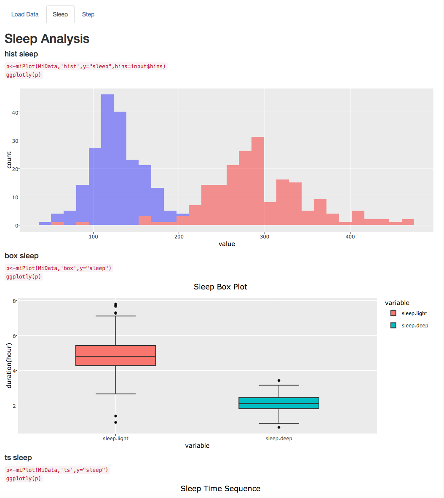

# MiAnalysis
MiAnalysis is a [Shiny App](https://chagolchana.shinyapps.io/MiAnalysis/) is in shinyio server. However, the free tier has only 25 hours per month. If the usage time is running out, you could install it call *runExample()* function to run a local version of MiAnalysis.

## Room of Requirements

Install all the packages and requieremnts in R. ALong with proper user priviledge (shiny). It did casue me a huge pain to get it figured out.

## How it looks

I have not added all the analysis I wanted to do in it yet. Also the app is very rough around teh edges since it's my first R project.

## Data

The data is in the "data" folder. The happy looking database.zip.

# How do I run

If you don' have your own data source

1. Click on "dmeo Data"
2. DO NOT change user id
3. DO NOT choose any file
4. Click on Submit (don't touch anything else)

If you ahve your own data. Change point 2 and 3.

## I don't want to install R

Excellent. Head over to https://chagolchana.shinyapps.io/MiAnalysis/ . And don't forget to read the caveat if you haven't read the first line.

## TODO

A lot. This is an ongoing process. I will keep updating a markdown with details and exploratory analysis.
